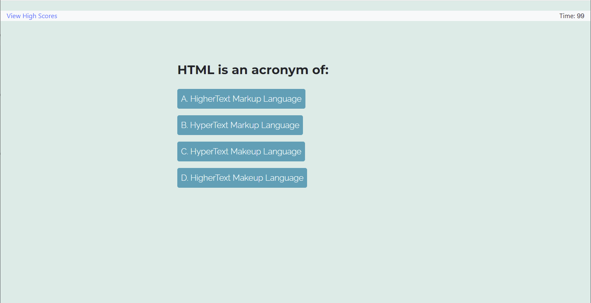

# Code Quiz Challenge

deployment: https://rob-watson-84.github.io/code_quiz/
Github: https://github.com/Rob-Watson-84/code_quiz

## About
Created a coding quiz with multiple-choice questions. Utilizing bootstrap, the application should have a clean and responsive interface.

## Demo

## Functionality
- Page has title and button to start the quiz. 
- Pressing the button starts the countdown timer and gets your first question.
- Gives user feedback if the correct or incorrect answer is chosen. 
- Highscores are stored in local storage.
- Timer Interval decrements by 10 seconds if the incorrect answer is chosen. 
- Final score derived from total time left.
- Once the game is over, user is presented with entering initials and buttons to go back to the main page and start again or view highscores.

## Homework Assignment Given Design

